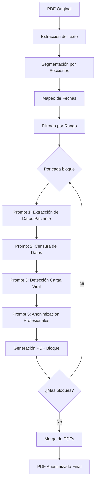
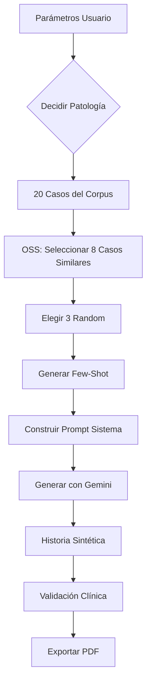

# 🏥 Sistema de Anonimización y Generación Sintética de Historias Clínicas

Proyecto de tesis que combina dos herramientas complementarias para el procesamiento de historias clínicas de infectología utilizando modelos de lenguaje grandes (LLMs):

1. **🔒 Anonimizador**: Censura información sensible de historias clínicas en PDF
2. **🧬 Generador Sintético**: Crea historias clínicas sintéticas realistas para investigación y entrenamiento

> [!IMPORTANT]
> Ambas herramientas están diseñadas específicamente para **historias clínicas de infectología** del sistema de salud uruguayo, imitando el estilo telegráfico y las abreviaciones locales del corpus hospitalario real.

## 📋 Tabla de Contenidos

- [Características](#-características)
- [Arquitectura](#-arquitectura-del-proyecto)
- [Instalación](#-instalación)
- [Uso](#-uso)
  - [Anonimizador de Historias Clínicas](#1-anonimizador-de-historias-clínicas)
  - [Generador de Historias Sintéticas](#2-generador-de-historias-sintéticas)
- [Configuración](#-configuración)
- [Privacidad y Seguridad](#-privacidad-y-seguridad)

---

## ✨ Características

### 🔒 Anonimizador de Historias Clínicas

- **Extracción inteligente de datos identificatorios**: detecta nombre, documento y dirección del paciente desde el encabezado
- **Censura completa**: oculta datos personales en todo el documento
- **Anonimización de profesionales**: censura nombres de médicos y personal sanitario en secciones como "Responsables del registro"
- **Procesamiento de carga viral**: detecta menciones de valores virales y los redondea según reglas predefinidas para mantener privacidad
- **Filtrado por fechas**: selecciona evoluciones dentro de rangos temporales específicos
- **Pipeline configurable**: procesa documentos por bloques con callbacks de progreso
- **Generación PDF**: exporta la historia anonimizada en formato PDF listo para compartir

### 🧬 Generador de Historias Sintéticas

- **Three modos de generación**:
  - **Manual**: control total sobre edad, sexo, patología y motivo de consulta
  - **Patología y motivo libres**: el modelo decide edad/sexo pero respeta patología de infectología
  - **Totalmente libre**: generación completamente automática
- **Few-shot learning**: utiliza casos reales similares para mejorar la autenticidad
- **Selección semántica de casos (OSS)**: usa OpenRouter para elegir los 8 casos más similares clínicamente
- **Estilo auténtico**: reproduce el registro telegráfico, abreviaciones y "imperfecciones" del corpus uruguayo real
- **Validación clínica**: solo genera casos de infectología, rechaza patologías fuera del ámbito
- **Exportación dual**: descarga tanto la historia generada como los few-shots utilizados en PDF

### 🤖 Soporte Multi-Modelo

- **Ollama** (local): Qwen 2.5 (3B, 7B) para máxima privacidad
- **Google Gemini** (API): para generación sintética de alta calidad
- **OpenRouter** (API): para selección semántica de casos (One-Shot Selection)

---

## 🏗️ Arquitectura del Proyecto

```
Tesis/
├── src/
│   ├── app/                                    # Aplicaciones Streamlit
│   │   ├── Anonimizador_de_historias_clínicas.py    # App principal de anonimización
│   │   └── pages/
│   │       └── Historias_sintéticas.py              # Generador de datos sintéticos
│   │
│   ├── llm/                                    # Clientes de modelos LLM
│   │   ├── ollama_client.py                        # Cliente Ollama (local)
│   │   ├── gemini_client.py                        # Cliente Google Gemini
│   │   ├── openrouter_client.py                    # Cliente OpenRouter
│   │   ├── model_config.py                         # Configuración de modelos
│   │   └── prompts.py                              # Plantillas de prompts
│   │
│   ├── services/                               # Lógica de negocio
│   │   ├── pipeline.py                             # Pipeline de anonimización
│   │   ├── patient_extraction.py                   # Extracción de datos del paciente
│   │   ├── fewshot_service.py                      # Selección semántica de casos (OSS)
│   │   ├── synthetic_data.py                       # Carga de casos desde JSON
│   │   └── synthetic_generator.py                  # Generación de historias sintéticas
│   │
│   └── utils/                                  # Utilidades
│       ├── pdf_utils.py                            # Lectura y procesamiento de PDFs
│       ├── pdf_export.py                           # Generación y merge de PDFs
│       ├── section_utils.py                        # Manejo de secciones y fechas
│       └── text_utils.py                           # Utilidades de texto
│
├── data_partesintetica/                        # Datos sintéticos
│   └── casos.json                                  # 20 casos reales para few-shot
│
├── .venv/                                      # Entorno virtual Python
├── requirements.txt                            # Dependencias
└── README.md
```

### 📊 Pipeline de Anonimización



### 🧬 Pipeline de Generación Sintética



---

## 🚀 Instalación

### Requisitos Previos

- **Python 3.9** (recomendado)
- **Ollama** (opcional): para usar modelos locales - [ollama.ai](https://ollama.ai)
- **API Keys** (opcional):
  - **Google Gemini**: para generación sintética - [AI Studio](https://makersuite.google.com/app/apikey)
  - **OpenRouter**: para selección semántica de casos - [openrouter.ai](https://openrouter.ai)

### Instalación Paso a Paso

#### 1. Clonar el repositorio

```bash
git clone https://github.com/tuusuario/Tesis.git
cd Tesis
```

#### 2. Crear y activar entorno virtual

**Windows:**
```bash
# Crear entorno virtual con Python 3.9
py -3.9 -m venv .venv

# Activar entorno
.venv\Scripts\activate
```

**Linux/macOS:**
```bash
# Crear entorno virtual
python3.9 -m venv .venv

# Activar entorno
source .venv/bin/activate
```

#### 3. Instalar dependencias

```bash
pip install -r requirements.txt
```

#### 4. Configurar modelos de lenguaje

##### Opción A: Ollama (local, recomendado para anonimización)

1. Instalar Ollama desde [ollama.ai](https://ollama.ai)

2. Descargar los modelos Qwen:

```bash
ollama pull qwen2.5:7b
ollama pull qwen2.5:3b
```

3. Verificar instalación:

```bash
ollama list
```

4. Asegurar que Ollama esté ejecutándose:

```bash
ollama serve
```

##### Opción B: Google Gemini (API, para generación sintética)

1. Obtener API key desde [Google AI Studio](https://makersuite.google.com/app/apikey)

2. Configurar en el archivo `src/app/pages/Historias_sintéticas.py`:

```python
GEMINI_API_KEY = "tu-api-key-aqui"
```

O configurar como variable de entorno:

**Windows:**
```bash
set GEMINI_API_KEY=tu-api-key-aqui
```

**Linux/macOS:**
```bash
export GEMINI_API_KEY=tu-api-key-aqui
```

##### Opción C: OpenRouter (API, para selección semántica de casos)

1. Obtener API key desde [OpenRouter](https://openrouter.ai)

2. Configurar en el archivo `src/app/pages/Historias_sintéticas.py`:

```python
OPENROUTER_KEY = "tu-api-key-aqui"
```

---

## 📖 Uso

### 1. Anonimizador de Historias Clínicas

#### Ejecutar la aplicación

```bash
streamlit run src/app/Anonimizador_de_historias_clínicas.py
```

La aplicación se abrirá en `http://localhost:8501`.

#### Flujo de trabajo

1. **Seleccionar modelo LLM**: 
   - Qwen 8B (Ollama) - recomendado
   - Qwen 4B (Ollama) - más rápido, menor precisión

2. **Cargar PDF**: 
   - Subir la historia clínica a anonimizar
   - El sistema extraerá automáticamente el texto y detectará secciones

3. **Vista previa**:
   - Revisar las primeras líneas del documento
   - Verificar el rango de fechas detectado
   - Ver cantidad de secciones identificadas

4. **Configurar rango de fechas**:
   - Fecha inicial: primera evolución a incluir
   - Fecha final: última evolución a incluir
   - Solo se procesarán secciones dentro de este rango

5. **Procesar**:
   - Click en "Procesar PDF"
   - El sistema ejecutará:
     - **Prompt 1**: Extracción de datos del paciente (nombre, documento, dirección)
     - **Prompt 2**: Censura de datos identificatorios
     - **Prompt 3**: Detección y redondeo de carga viral
     - **Prompt 5**: Anonimización de profesionales
   - Barra de progreso mostrará avance por bloques

6. **Descargar PDF anonimizado**:
   - Click en "Descargar PDF anonimizado"
   - El archivo estará listo para compartir sin datos sensibles

#### Ejemplo de uso

```
Historia original:
-------------------
Paciente: Juan Pérez
DNI: 1.234.567-8
Dirección: Av. Italia 2020

EA: Consulta por tos productiva. CV detectada: 1.234.567 copias/ml.
Responsables: Dr. García y Dra. Rodríguez

Historia anonimizada:
---------------------
Paciente: [CENSURADO]
DNI: [CENSURADO]
Dirección: [CENSURADO]

EA: Consulta por tos productiva. CV detectada: >100.000 copias/ml.
Responsables: [Profesional 1] y [Profesional 2]
```

---

### 2. Generador de Historias Sintéticas

#### Ejecutar la aplicación

```bash
streamlit run src/app/pages/Historias_sintéticas.py
```

La aplicación se abrirá en `http://localhost:8501`.

> [!NOTE]
> Asegurate de haber configurado las API keys de **Gemini** y **OpenRouter** antes de usar esta herramienta.

#### Modos de generación

##### 🎯 Modo 1: Manual (Control Total)

Ideal para generar casos específicos con parámetros exactos.

**Parámetros**:
- Edad: 0-120 años
- Sexo: Femenino / Masculino / Otro
- Patología: elegir entre las 13 patologías disponibles
- Motivo: descripción libre del contexto clínico

**Patologías disponibles**:
- VIH
- Tuberculosis pulmonar
- Tuberculosis ganglionar
- Meningitis bacteriana
- Endocarditis
- Infección de prótesis osteoarticular
- Celulitis
- Fiebre prolongada
- Neumonía adquirida en la comunidad
- Infección urinaria
- Candidemia
- Infección de sitio quirúrgico
- Sepsis de origen desconocido

**Ejemplo**:
```
Edad: 45
Sexo: Masculino
Patología: Tuberculosis pulmonar
Motivo: Venezolano, radicado en Uruguay. Vive con pareja. 
        Consulta por tos productiva de 3 semanas.
```

##### 🧩 Modo 2: Patología y Motivo Libres

El modelo decide edad y sexo, pero respeta el contexto que proveas.

**Parámetros**:
- Motivo: descripción de la situación clínica

**Ejemplo**:
```
Motivo: Paciente brasileño, consulta por fiebre y cefalea intensa 
        luego de viaje a zona endémica de dengue.
```

##### 🎲 Modo 3: Totalmente Libre

El modelo genera un caso completo de infectología de forma autónoma.

**Sin parámetros**: solo hacer click en "Generar historia clínica".

#### Pipeline de generación

1. **Selección Semántica de Casos (OSS)**:
   - OpenRouter analiza los 20 casos del corpus (`casos.json`)
   - Selecciona los 8 casos más similares clínicamente a la patología objetivo
   - No busca coincidencias de palabras, sino similitud fisiopatológica real

2. **Construcción del Few-Shot**:
   - De los 8 casos, elige 3 aleatoriamente
   - Genera un prompt con estos casos como ejemplos

3. **Generación con Gemini**:
   - Usa el prompt del sistema (estilo telegráfico uruguayo)
   - Incorpora los few-shots seleccionados
   - Genera la historia clínica sintética

4. **Validación**:
   - Verifica que el caso sea de infectología
   - Rechaza patologías fuera del ámbito (fracturas, migraña, etc.)

#### Resultado

La aplicación mostrará:

1. **Historia clínica generada**: en formato texto, lista para revisar
2. **Few-shots utilizados**: los 3 casos del corpus que sirvieron como referencia
3. **Botones de descarga**:
   - Descargar HISTORIA final en PDF
   - Descargar FEW-SHOT en PDF

#### Ejemplo de salida

```
SM 52 años
AI: Niega
AQ: Niega
AEA: Niega

EA: Hace 15 días comienza con tos seca, progresivamente productiva, 
blanquecina. Asocia sudoración nocturna, astenia y pérdida ponderal 
no cuantificada. Sin hemoptisis. Consulta por persistencia sintomática.

EF:
TA: 110/70 FC: 88 FR: 18 T: 37.8 SatO2: 94% aa
Regular estado general. Consciente, orientado.
CP: MP simétrico. Estertores en base derecha.
CardioVasc: RR2T sin soplos
Abdomen: Blando, depresible, indoloro
```

---

## 🔧 Configuración

### Modelos disponibles

Editar `src/llm/model_config.py` para:

- **Cambiar modelos por defecto**:
```python
MODEL_CONFIGS = {
    "Qwen 8B (Ollama)": {
        "model_name": "qwen2.5:7b",  # cambiar aquí
        "temperature": 0.0,
        # ...
    }
}
```

- **Ajustar parámetros**:
  - `temperature`: creatividad del modelo (0.0 = determinista)
  - `num_ctx`: tamaño del contexto
  - `num_predict`: tokens máximos a generar
  - `top_p`, `top_k`: muestreo
  - `repeat_penalty`: penalización de repeticiones

- **Configurar procesamiento**:
```python
SECTIONS_PER_BLOCK = 1  # secciones por bloque
USE_CHUNKING = True     # dividir en chunks
MAX_CHARS_PER_CHUNK = 15000
```

### Personalización de prompts

Editar `src/llm/prompts.py` para modificar:

- **Prompt 2**: Censura de datos del paciente
- **Prompt 3**: Detección de carga viral y reglas de redondeo
- **Prompt 5**: Anonimización de profesionales

Editar `src/services/synthetic_generator.py` para ajustar:

- **System prompt**: estilo de escritura, abreviaciones, estructura de secciones
- **Patologías válidas**: lista de patologías de infectología permitidas

### Configuración de casos sintéticos

Editar `data_partesintetica/casos.json` para:

- Agregar nuevos casos de referencia
- Modificar casos existentes
- El formato es un array de strings, cada string es un caso completo

---

## 🛡️ Privacidad y Seguridad

> [!CAUTION]
> Este sistema procesa datos médicos altamente sensibles protegidos por leyes de privacidad (HIPAA, GDPR, Ley 18.331 de Uruguay).

### Recomendaciones de seguridad

#### Para Anonimización

1. **Usar modelos locales (Ollama)**:
   - Los datos nunca salen de tu máquina
   - No hay riesgo de filtración a terceros
   - Cumplimiento total con normativas de privacidad

2. **Revisar PDFs anonimizados**:
   - Siempre verificar el resultado antes de compartir
   - El sistema puede no detectar el 100% de los datos sensibles
   - Buscar manualmente menciones del nombre en contextos inusuales

3. **No usar APIs públicas con datos reales**:
   - Gemini y OpenRouter envían datos a servidores externos
   - Solo usar para pruebas con datos ficticios
   - Para producción en hospitales: **solo Ollama local**

#### Para Generación Sintética

1. **Datos sintéticos no son datos reales**:
   - Útiles para investigación, entrenamiento y pruebas
   - No reemplazan historias clínicas reales para diagnóstico
   - Pueden contener inconsistencias clínicas menores

2. **API Keys**:
   - No compartir tus claves de Gemini/OpenRouter
   - Agregar `src/app/pages/Historias_sintéticas.py` al `.gitignore` si pusiste keys hardcodeadas
   - Mejor práctica: usar variables de entorno

3. **Corpus de casos**:
   - `casos.json` puede contener datos reales anonimizados
   - No compartir públicamente sin verificar que esté totalmente anonimizado
   - Revisar permisos de uso según IRB/comité de ética

### Limitaciones

> [!WARNING]
> - **Falsos negativos**: El sistema puede no detectar todos los datos sensibles, especialmente en formatos no estándar
> - **Contexto clínico**: Algunos datos pueden ser re-identificables por contexto (combinación de edad + patología rara + hospital)
> - **Abreviaciones locales**: El modelo puede no reconocer todas las abreviaciones específicas del hospital
> - **Datos en imágenes**: Si el PDF contiene escaneos de texto, no serán anonimizados

---

## 📦 Dependencias Principales

```txt
streamlit>=1.37.0        # Framework de interfaz web
requests>=2.32.0         # Cliente HTTP para APIs
pymupdf>=1.23.0          # Procesamiento y generación de PDFs
google-generativeai      # Cliente de Google Gemini
```

### Instalación de dependencias adicionales

Para desarrollo:

```bash
pip install pytest black flake8
```

---

## 🧪 Testing

> [!TIP]
> Antes de usar en producción, probar con historias clínicas sintéticas o ficticias.

### Test de anonimización

1. Generar una historia sintética usando el generador
2. Descargar el PDF generado
3. Subirlo al anonimizador
4. Verificar que los datos ficticios sean correctamente censurados

### Test de generación

1. Probar los 3 modos de generación
2. Verificar que las patologías se respeten
3. Revisar el estilo telegráfico y abreviaciones
4. Validar coherencia clínica con un médico infectólogo

---

## 🤝 Contribuciones

Las contribuciones son bienvenidas. Para contribuir:

1. Fork el proyecto
2. Crea una rama para tu feature:
   ```bash
   git checkout -b feature/MejorAnonimizacion
   ```
3. Commit tus cambios:
   ```bash
   git commit -m 'feat: agregar detección de emails'
   ```
4. Push a la rama:
   ```bash
   git push origin feature/MejorAnonimizacion
   ```
5. Abre un Pull Request

### Áreas de mejora

- [ ] Soporte para más patologías (cardiología, neurología, etc.)
- [ ] Detección de números de teléfono y emails
- [ ] Anonimización de fechas de nacimiento
- [ ] Interfaz para configurar reglas de redondeo personalizadas
- [ ] Exportación a FHIR
- [ ] Tests automatizados con pytest
- [ ] Docker containerization
- [ ] API REST para integración con sistemas hospitalarios

---

## 📄 Licencia

Este proyecto es parte de una **tesis de grado** en la Universidad de la República (UdelaR), Uruguay.

**Consultar con el autor para uso, modificación y distribución.**

---

## 👤 Autor

**Sebastian Celesia**

- Email: [sebastian.celesia@fing.edu.uy](mailto:sebastian.celesia@fing.edu.uy)
- Universidad: Universidad de la República (UdelaR)
- Facultad: Facultad de Ingeniería (FING)

---

## 🙏 Agradecimientos

- **Modelos Qwen** desarrollados por Alibaba Cloud
- **Comunidad de Streamlit** por el excelente framework
- **Proyecto Ollama** por facilitar el uso local de LLMs
- **Google Gemini** por su API de generación de texto
- **OpenRouter** por el acceso unificado a múltiples modelos
- **Hospital Maciel, Clínicas, Pasteur e INOT** por el corpus de referencia
- **Tutores y colaboradores** de la tesis

---

## 📚 Citas y Referencias

Si utilizás este trabajo en investigación académica, por favor citar:

```bibtex
@mastersthesis{celesia2025anonimizacion,
  author = {Celesia, Sebastian},
  title = {Sistema de Anonimización y Generación Sintética de Historias Clínicas mediante LLMs},
  school = {Universidad de la República, Facultad de Ingeniería},
  year = {2025},
  type = {Tesis de Grado}
}
```

---

## 📞 Soporte

Para reportar bugs, solicitar features o hacer preguntas:

- **GitHub Issues**: [github.com/tuusuario/Tesis/issues](https://github.com/tuusuario/Tesis/issues)
- **Email**: sebastian.celesia@fing.edu.uy

---

⭐ **Si este proyecto te fue útil, no olvides darle una estrella en GitHub!**

---

## 🗺️ Roadmap

### v1.0 (Actual)
- ✅ Anonimización de historias clínicas en PDF
- ✅ Generación sintética con 3 modos
- ✅ Soporte Ollama, Gemini y OpenRouter
- ✅ Filtrado por fechas
- ✅ Exportación a PDF

### v1.1 (Próximo)
- [ ] Detección de emails y teléfonos
- [ ] Configuración de reglas vía UI
- [ ] Logs de auditoría
- [ ] Métricas de calidad de anonimización

### v2.0 (Futuro)
- [ ] Soporte multi-especialidad
- [ ] API REST
- [ ] Exportación FHIR
- [ ] Dashboard de estadísticas
- [ ] Modo batch para múltiples PDFs

---

**Última actualización**: Diciembre 2024
